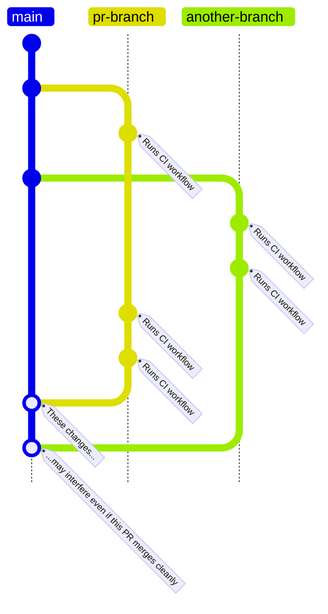

Continuous Integration
======================

Workflows
---------

### [`pr.md`](../.github/workflows/pr.yml)

```gherkin
Feature: test changes before they are merged

    As a developer, I want to test the changes I'm working on and maybe share them with someone else.

    Background:
        Given a set of code changes

    Scenario: Testing a set of mcu-bootloader changes
        When a new PR is opened
        And the PR includes changes to the mcu-bootloader sources
        Then the GitHub Actions triggers the pr.yml workflow
        And the worker builds a new debug mcu-bootloader
        And the worker saves the mcu-bootloader binaries in the run's artifacts

    Scenario: Testing a set of mcu-firmware changes
        When a new PR is opened
        And the PR includes changes to the mcu-firmware sources
        Then the GitHub Actions triggers the pr.yml workflow
        And the worker builds a new debug mcu-firmware
        And the worker saves the mcu-firmware binaries in the run's artifacts

    Scenario: Testing a set of pi-firmware changes
        When a new PR is opened
        And the PR includes changes to the pi-firmware sources
        Then the GitHub Actions triggers the pr.yml workflow
        And the worker builds a new debug mcu-firmware
        And the worker runs tests on pi-firmware
        And the worker packages mcu-firmware into pi-firmware
        And the worker saves the mcu-firmware binaries in the run's artifacts
        And the worker saves the pi-firmware binaries in the run's artifacts

    Scenario: Testing a set of changes before they are merged
        When a PR is reviewed
        And the PR is approved
        And the reviewer initiates the PR to be merged
        Then the PR is added to the Merge Queue
        And the Merge Queue uses the pr.yml workflow to check and test the changed software
        And if the tests pass, the Merge Queue will merge the changes
```

This workflow makes sure that code that reaches the `main` branch builds and contains no
known regressions.

The workflow builds binaries and packages, and runs tests. A [subproject](glossary.md#subproject) is
only tested if its contents change.

MCU binaries are built in Debug mode, meaning they are bigger, less performant, but contain
debug information and additional checks.

We currently do not have the capability to package in binaries from the `main` branch.
Therefore, if `pi-firmware` needs to be checked, it will rebuild `mcu-firmware`, too. 

#### Workflow artifacts

The workflow artifacts will appear in the Artifacts section associated to the workflow run. You can
find this by:

- From the [repository root](https://github.com/STEAM-Academy-PRO/revolution-robotics-robot-mind)
- Select the `Actions` tab
- On the sidebar, select `PR checks`
- From the list, select the upmost entry that belongs to the PR you are testing
- You can find the `Artifacts` section at the bottom of the page

There are three possible artifacts depending on what the PR changes:

- `mcu-bootloader`: contains a `*.bin` and `*.elf` file built using the debug configuration
- `mcu-firmware`: contains a `*.bin` and a `catalog.json` file. The binary is build using the debug configuration. The `json` contains metadata used by `pi-firmware`.
> TODO: this is less interesting now. Debug builds should upload the `.elf` for debugging. Maybe rename this particular artifact to `mcu-firmware-dist`?
- `pi-firmware`: contains a `*.data` and a `*.meta` file. These files can be [installed on the brain](pi/install-data-meta.md).

#### Why do I have to rebase my PR?

We need to be sure that the PR plays nice with changed made to the main branch since.



### [`release.md`](../.github/workflows/release.yml)

```gherkin
Feature: release the firmware to the users

    As a product manager, I want to release new software to our users.

    Background:
        Given the main branch is considered ready for release

    Scenario: Release a package that will appear as a software update
        When new changes are pushed to the release branch of the robot-mind repository
        Then GitHub Actions triggers the release.yml workflow
        And the worker builds a release mcu-bootloader
        And the worker builds a release mcu-firmware
        And the worker packages the mcu-firmware into pi-firmware
        And the pi-firmware is packaged
        And the mcu-bootloader binaries are added to the release
        And the mcu-firmware binaries are added to the release
        And the pi-firmware archive is added to the release
        And the pre-release is promoted to a release
```

#### Workflow artifacts

[Repository releases](https://github.com/STEAM-Academy-PRO/revolution-robotics-robot-mind/releases)

> TODO: need to revise after a test release

- `mcu-bootloader`: contains a `*.bin` and `*.elf` file built using the release configuration
- `mcu-firmware`: contains a `*.bin` and a `catalog.json` file. The binary is build using the release configuration. The `json` contains metadata used by `pi-firmware`.
- `pi-firmware`: contains a `*.data` and a `*.meta` file. These files can be [installed on the brain](pi/install-data-meta.md) or used as an OTA update in the mobile app.