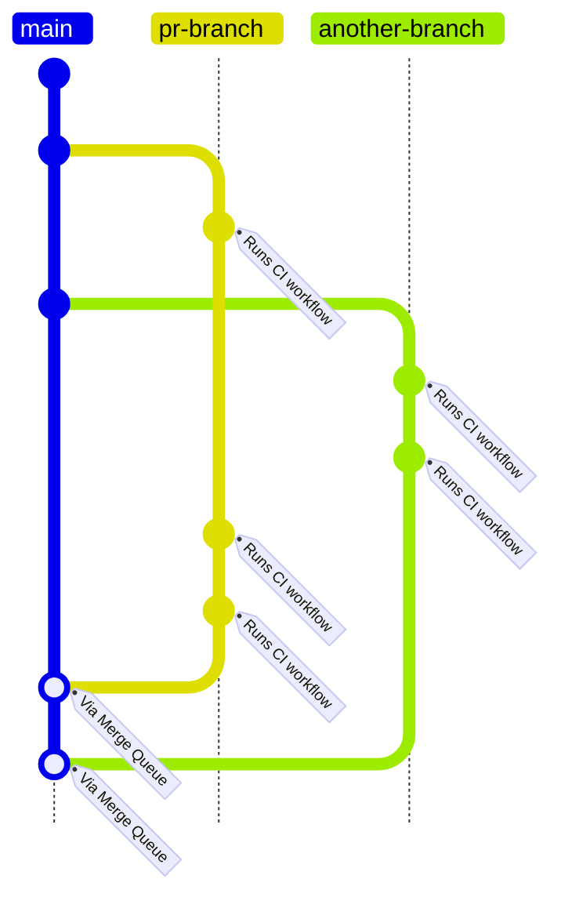

Continuous Integration
======================

Workflows
---------

### [`pr.md`](../.github/workflows/pr.yml)

This workflow makes sure that code that reaches the `main` branch builds and contains no
regressions.

The workflow builds binaries and packages, and runs tests. A [subproject](glossary.md#subproject) is
only tested if its contents change.

MCU binaries are built in Debug mode, meaning they are bigger, less performant, but contain
debug information and additional checks.

We currently do not have the capability to package in binaries from the `main` branch.
Therefore, if `pi-firmware` needs to be checked, it will rebuild `mcu-firmware`, too. 

The workflow is also used in the merge queue. Testing this way ensures the PR is compatible with
changes made to the `main` branch.

### [`release.md`](.)

TBD
