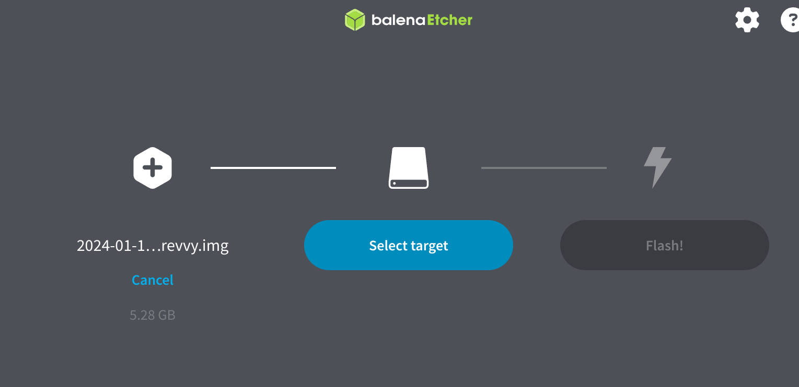

# How to create the SD-card?

## Software you need

Download [balena etcher](https://github.com/balena-io/etcher/releases) - click the assets dropdown under releases, download your OS's version!

## Flash an image

1. Download the latest built image zip from the CI pipeline output

[Pi OS releases](https://github.com/STEAM-Academy-PRO/revolution-robotics-pi-os/releases)

2. Open balena etcher, click flash from file

3. Insert an SD card, select target the inserted SD Card

4. Wait until it's done!

5. Put it in the raspberry, and boot it up!
