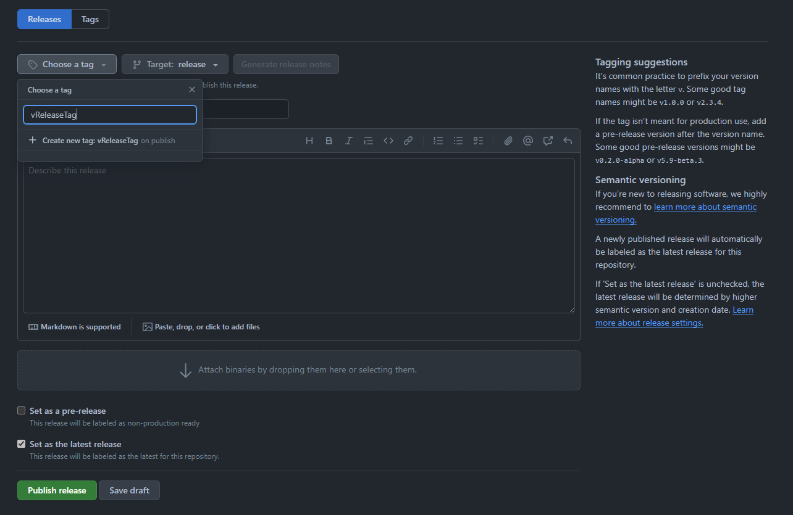

How to release a new package
============================

Release a Pi firmware update
----------------------------

- Be absolutely sure everything works
- Create a new [**pre-release**](https://github.com/STEAM-Academy-PRO/revolution-robotics-robot-mind/releases/new)
  - Make sure the target branch is `release`!
  - Click `Choose a tag`, give a name to the tag (usually `v<Version>` where `<Version>` is the number of commits), then click `Create new tag`.
  - Click `Generate release notes`
  - Fill in the title, add additional information to the release description.
  - Check the `Set as a pre-release` box
  - Press `Publish release`
- The CI's [release workflow](ci.md#release) will build artifacts, add them to the release and publish the release
- Wait for the build to succeed and for the artifacts to appear in the [releases](https://github.com/STEAM-Academy-PRO/revolution-robotics-robot-mind/releases)

### Anatomy of a release

A release on GitHub contains the following files:

- `framework-<VERSION>.tar.gz`: the OTA package that can be distributed to users
- `pi-firmware.data`, `pi-firmware.meta`: update packages that can be manually installed on a brain
- `revvy_firmware-<VERSION>.bin`, `catalog.json`: MCU firmware update that can be added to a Pi firmware package
- `mcu_firmware.elf`, `bootloader.elf`: MCU firmware and bootloader binaries for manual flashing
- `bootloader.bin`: Raw MCU bootloader binary for manual flashing - for factory use

Create a new Pi OS image
------------------------

### For release

- Release a new Pi firmware, as written above
- Update [The OS builder config](https://github.com/STEAM-Academy-PRO/revolution-robotics-pi-os/blob/main/config) with the new Pi firmware **release tag**
  - Example: `FIRMWARE_RELEASE=v1286`
- Commit your changes and push to `main`
- Create a new [**pre-release**](https://github.com/STEAM-Academy-PRO/revolution-robotics-pi-os/releases/new)
- Wait for the build to succeed and for the image to appear in the [releases](https://github.com/STEAM-Academy-PRO/revolution-robotics-pi-os/releases)

### For testing

- Create a new branch in the Pi OS repo
- Update [The OS builder config](https://github.com/STEAM-Academy-PRO/revolution-robotics-pi-os/blob/main/config) with
  - a new Pi firmware **revision**: `FIRMWARE_REV=12e88a4225bd9a6f00ee611bab5dbed20e3561c9`
  - a new Pi firmware **release tag**: `FIRMWARE_RELEASE=v1286`
- Commit your changes and push
  > Do **not** push to `main`!
- Open a PR. CI will build image & create an artifact. You will be able to download the image from the `Actions` tab, under your branches workflow.
